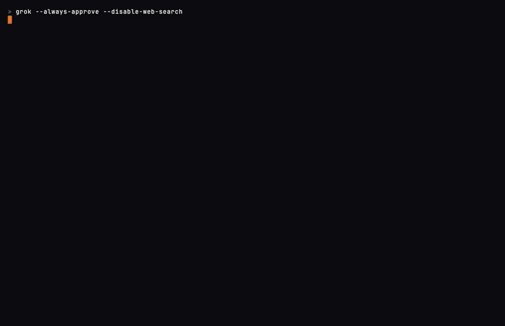

# Grok "delegate a festival" demo — A/B for the how-it-works step

Both clips are the **same real Grok Build session**: you open Grok, type one sentence,
and it scaffolds the plan. Nothing is mocked. They differ only in the `fest show`
payoff at the end.

Recorded from the real `grok` binary via termcast (vhs), against a throwaway
`social-fitness-app` fixture campaign.

## Version A — scaffolded payoff

The delegation and Grok's work are real; the closing `fest show` is a clean,
hand-built single-phase plan (22 tasks) shown in full.

## Version B — Grok's actual plan

Same delegation clip, but the closing `fest show` is the plan Grok **really** produced
when left to run the full planning loop: 8 phases, 17 sequences, ~160 items
(`INGEST` → `PLAN` → 5 `IMPLEMENT` phases → `REVIEW`), collapsed to show the scale.

---

Temporary comparison. Once a version is chosen, it gets wired into the landing
how-it-works "delegate" step and this file + the losing gif are removed.
