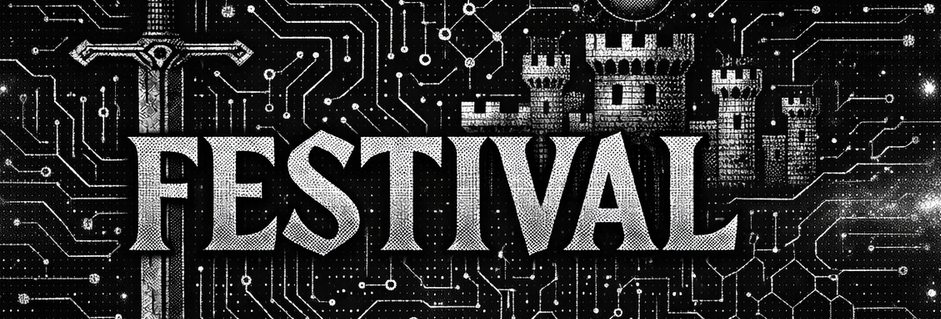
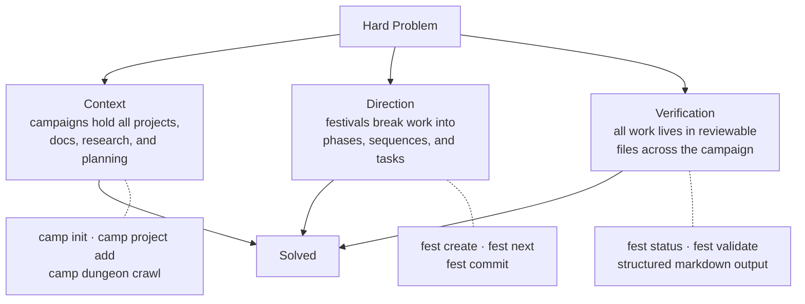

# Festival



**A standardized workspace and workflow for solving difficult, multi-faceted problems with AI.**

To use AI to solve hard problems you need three things: **context**, **direction**, and **verification**. Festival provides a structured layer for each, resulting in dramatically fewer tokens and less time spent getting to the outcome you want.

> [Get started](https://fest.build/getting-started/quickstart) (takes ~5 minutes).



## Install

**macOS:**

```bash
brew install Obedience-Corp/tap/festival
```

**Arch Linux:**

```bash
yay -S festival-bin
```

**Debian/Ubuntu:** Download `.deb` from [releases](https://github.com/Obedience-Corp/festival/releases/latest)

**Windows:** Stable Windows packages are temporarily paused while support is being hardened.
For now, use WSL2 and the Linux install method above.

## Quick Start

```bash
# Shell integration (add to ~/.zshrc)
eval "$(camp shell-init zsh)"
eval "$(fest shell-init zsh)"

# Create a campaign
camp init my-project && cd my-project

# Add a project
camp project add https://github.com/you/your-repo

# Create your first festival
fest create festival --name "my-first-feature" --type standard

# Fill the generated REPLACE markers in the new festival files
# Then validate before execution
fest validate

# Start working
fest next
```

After installing, see the [quick start guide](https://fest.build/getting-started/quickstart/) for shell setup and first steps.

## The Problem

AI coding tools are fast. But speed without context and direction just means you burn tokens faster. Every new session starts from zero -- no memory of the larger goal, no structure for multi-step work, no way to pick up where you left off. You end up re-explaining the same context, getting inconsistent results, and losing coherence across sessions.

Traditional tools don't solve this because they weren't designed for it. You need:

1. **Context** -- a workspace that holds all projects, docs, and planning for a mission in one place
2. **Direction** -- structured plans that AI agents can pick up, execute, and resume without losing the thread
3. **Verification** -- quality gates and completion criteria baked into the workflow, not bolted on after

## What Festival Does

Festival ships two CLIs -- `camp` and `fest` -- that solve the three problems above.

**`camp`** manages campaigns: isolated workspaces that hold all the projects, docs, research, and planning for a single mission. It gives you instant navigation across everything in the workspace, project lifecycle management, and shell shortcuts that make `cd` obsolete.

**`fest`** manages festivals: structured plans that break work into phases, sequences, and tasks -- a hierarchy designed for AI agents to execute autonomously, pause, and resume without context loss. Run `fest next` and the agent gets its next task with full surrounding context. Run `fest commit` and every commit traces back to the plan.

### Where Festival Fits

Festival is a **planning and context layer**, not a runtime orchestrator. It doesn't spawn agents or manage their processes -- it gives them the structure, context, and goals they need to work autonomously. Runtime orchestrators tell agents what to do next. Festival tells agents *why* they're doing it, what success looks like, and where they are in a larger mission.

The context model is persistent and filesystem-based -- plans survive across sessions, days, and weeks, not just a single agent run. Festival is agent-agnostic: it works with Claude Code, Cursor, Codex, Aider, or any tool that can read files and run commands. Use an orchestrator to manage parallel agents, and Festival to give each agent the plan and context it needs.

### Real Example

Here's what `obey-campaign` looks like -- a real campaign that orchestrates Obedience Corp's internal platform and product stack:

```
obey-campaign/
├── projects/                     # 19 project submodules
│   ├── camp/                     # Campaign CLI
│   ├── fest/                     # Festival planning CLI
│   ├── festival/                 # Distribution repo (this one)
│   ├── obey-platform-monorepo/   # Core platform
│   ├── obey-chat/                # Chat client
│   ├── guild-core/               # Reference implementation
│   ├── obediencecorp.com/        # Company website
│   ├── prototypes/               # Experiment sandbox
│   └── ...                       # 11 more projects
├── festivals/                    # Festival lifecycle workspace
│   ├── planning/                 # Festivals being designed
│   ├── active/                   # Currently executing
│   ├── ready/                    # Prepared, awaiting execution
│   ├── ritual/                   # Recurring processes
│   └── dungeon/                  # completed/ | archived/ | someday/
├── workflow/                     # Intents, code reviews, pipelines
├── ai_docs/                      # AI research and documentation
├── docs/                         # Human-authored documentation
└── CLAUDE.md                     # Agent instructions
```

Every project, every plan, every piece of context for this mission lives here. `cgo p fest` jumps to the fest project. `fgo` toggles between a festival and its linked project. Everything is navigable by both humans and AI agents.

## Navigation -- the killer feature

Shell integration gives you shorthand functions that make navigating a campaign instant. Add these to your shell config:

```bash
eval "$(camp shell-init zsh)"   # gives you: cgo, cr, csw, cint
eval "$(fest shell-init zsh)"   # gives you: fgo, fls
```

### cgo -- jump anywhere in your workspace

`cgo` wraps `camp go` with real `cd` behavior. It's the fastest way to move around:

```bash
cgo                   # Toggle between campaign root and last location
cgo p                 # Jump to projects/
cgo p api             # Fuzzy-find "api" in projects/ (matches api-server, api-gateway, etc.)
cgo f                 # Jump to festivals/
cgo w                 # Jump to workflow/
cgo wt api@feat       # Jump to a worktree branch
```

Single-letter category shortcuts (`p`, `f`, `w`, `a`, `d`, `i`, `wt`, `du`, `cr`, `de`) map to top-level campaign directories. After the category, any additional argument is a fuzzy search -- `cgo p mono` lands you in `obey-platform-monorepo/`. Tab completion works at every level.

You can also run a command without leaving your current directory:

```bash
cgo -c p api ls       # Run ls inside projects/api-* without cd'ing
cr just build         # Run "just build" from campaign root
```

### fgo -- toggle between a festival and its linked project

`fgo` wraps `fest go`. Its standout feature is bidirectional toggling:

```bash
fgo                   # From a festival -> jump to its linked project
                      # From a linked project -> jump back to the festival

fgo 2                 # Jump to phase 002
fgo 2/1               # Jump to phase 2, sequence 1
fgo active            # Jump to festivals/active/
fgo active my-fest    # Jump to a specific active festival
```

Link a festival to a project once (`fgo link`) and `fgo` with no args toggles between them forever. Named shortcuts work too -- `fest go map n` bookmarks the current directory, then `fgo -n` jumps there.

### Other shorthands

| Shorthand | Expands to | What it does |
|-----------|------------|--------------|
| `csw`     | `camp switch` | Switch between campaigns (fuzzy match + interactive picker) |
| `cint`    | `camp intent add` | Quick-capture an idea to the intent inbox |
| `cr`      | `camp run` | Run a command from campaign root |
| `fls`     | `fest list` | List festivals by status |

### Concept shortcuts

`camp` supports shorthand for subcommands too. `camp p` expands to `camp project`, so these are identical:

```bash
camp p commit -m "fix bug"    # Same as: camp project commit -m "fix bug"
camp p add <url>              # Same as: camp project add <url>
camp p list                   # Same as: camp project list
```

## CLI Overview

Full reference: [fest CLI](https://fest.build/cli-reference/fest/) | [camp CLI](https://fest.build/cli-reference/camp/)

### camp -- workspace management

```bash
camp init my-startup             # Create a campaign
camp project add <url>           # Add a project as submodule
camp p commit -m "fix auth"      # Commit in a project (auto-stages all changes)
camp status all                  # Dashboard of all project statuses
camp doctor                      # Health check the workspace
camp intent add "idea"           # Capture an idea to the inbox
camp leverage                    # Measure productivity leverage across projects
```

### fest -- planning and execution

The core workflow: create a festival, then let `fest next` drive execution.

```bash
fest create festival --name "my-feature" --type standard  # Scaffold the beginner path
fest next                        # Get the next task with layered context (festival -> phase -> sequence -> task)
fest task completed              # Mark the current task done
fest workflow advance            # Complete a workflow step and move to the next
fest status                      # View progress across all levels
fest commit -m "implement auth"  # Git commit with automatic festival/task reference
fest understand                  # Teach an AI agent the full methodology
```

`fest next` is the entry point for agents -- it resolves what to do next, includes surrounding context from every level of the hierarchy, and respects workflow ordering and quality gates. An agent session is: `fest next` -> do the work -> `fest task completed` -> `fest commit` -> `fest next`.

## Submodules

> **Note:** The `camp` and `fest` source repositories are private. Binaries are distributed via the install methods above -- you do not need to clone the submodules.

## Documentation

Full documentation at **[fest.build](https://fest.build)**:

- [Methodology Overview](https://fest.build/methodology/overview/) -- Core principles and concepts
- [Agent Workflows](https://fest.build/guides/agent-workflows/) -- Using Festival with AI coding tools
- [First Festival Tutorial](https://fest.build/tutorials/first-festival/) -- End-to-end walkthrough
- [CI Integration](https://fest.build/tutorials/ci-integration/) -- Release smoke ownership and launch-path verification

## License

[Functional Source License 1.1 (FSL-1.1-ALv2)](LICENSE)

Built by [Obedience Corp](https://obediencecorp.com) -- AI that does what you want, the way you want it done.
