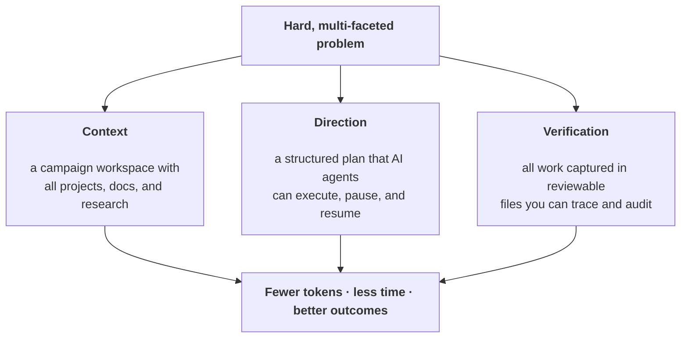
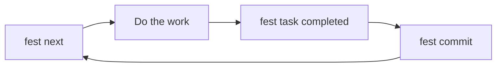

# Festival


**A standardized workspace and workflow for solving difficult, multi-faceted problems with AI.**

To use AI to solve hard problems you need three things: **context**, **direction**, and **verification**. Festival provides a structured layer for each, resulting in dramatically fewer tokens and less time spent getting to the outcome you want.

> [Get started](https://docs.fest.build/getting-started/quickstart) (takes ~5 minutes).


```mermaid
graph TD
    HP["<b>Hard, multi-faceted problem</b>"]

    HP --> C["<b>Context</b><br/><br/>a campaign workspace with<br/>all projects, docs, and research"]
    HP --> D["<b>Direction</b><br/><br/>a structured plan that AI agents<br/>can execute, pause, and resume"]
    HP --> V["<b>Verification</b><br/><br/>all work captured in reviewable<br/>files you can trace and audit"]

    C --> O["<b>Fewer tokens · less time · better outcomes</b>"]
    D --> O
    V --> O
```

## Install

**npm / pnpm / bun:**

```bash
npm install -g @obedience-corp/festival
```

**macOS:**

```bash
brew install --cask Obedience-Corp/tap/festival
```

**Arch Linux:**

```bash
yay -S festival-bin
```

**Debian/Ubuntu:** Download `.deb` from [releases](https://github.com/Obedience-Corp/festival/releases/latest)

**Windows:** Stable Windows packages are temporarily paused while support is being hardened.
For now, use WSL2 and the Linux install method above.

## Requirements

- `git` is required. `camp` and `fest` use git internally for campaign init, project management, template sync, and commit-aware workflows.
- `scc` is recommended but optional. Without it, `camp leverage` features will not work.

[](https://youtu.be/FY6vm74oa8o?si=ZFg87vA7u9G_79bX)

_[More walkthroughs, demos, and speed runs &rarr;](https://docs.fest.build/videos/)_

## Quick Start

```bash
# Shell integration (add one setup path to ~/.zshrc)

# Preferred when installed with install.sh:
source ~/.local/share/festival/shell/festival.zsh

# Or, if no helper file is installed:
eval "$(camp shell-init zsh)"
eval "$(fest shell-init zsh)"

# Create a campaign
camp init my-project && cd my-project

# Add a project
camp project add https://github.com/you/your-repo

# Create your first festival
fest create festival --name "my-first-feature" --type standard

# Fill the generated REPLACE markers in the new festival files
# Then validate before execution
fest validate

# Start working
fest next
```

After installing, see the [quick start guide](https://docs.fest.build/getting-started/quickstart/) for shell setup and first steps.

## The Problem

If you work on more than a few things at once, staying organized becomes a job of its own.

Your work spreads across repositories, documents, chats, notes, bookmarks, and AI conversations. Finding where something belongs becomes work. Remembering what you were doing becomes work. Switching between efforts becomes work.

AI makes this harder, not easier. It generates plans, code, research, and tasks faster than you can file them. The bottleneck moves from producing work to organizing it.

So every new AI session starts from zero. No memory of the larger goal, no structure for multi-step work, no way to pick up where you left off. You re-explain the same context, get inconsistent results, and lose coherence across sessions.

Festival is the organizational layer for work done with AI. Instead of asking "where should this go?" you put it in the campaign it belongs to. Instead of asking "what was I working on?" you resume the campaign. To turn that organization into outcomes, Festival gives every mission three things:

1. **Context**: a workspace that holds all projects, docs, and planning for a mission in one place
2. **Direction**: structured plans that AI agents can pick up, execute, and resume without losing the thread
3. **Verification**: completion criteria and reviewable output baked into the workflow, not bolted on after

## What Festival Does

Festival ships two CLIs (`camp` and `fest`) that solve the three problems above.

**`camp`** manages campaigns: isolated workspaces that hold all the projects, docs, research, and planning for a single mission, a high-level purpose like your startup, your job, or a hobby. A mission grows over time, and the campaign grows with it. It gives you instant navigation across everything in the workspace, project lifecycle management, and shell shortcuts that make `cd` obsolete.

Work items are the campaign-level work queue. `camp workitem` surfaces intents, design docs, explore notes, festivals, and custom tracked work through one dashboard. It can mark current work, link work to projects or festivals, and commit changes scoped to the resolved work item.

**`fest`** manages festivals: structured plans that break work into phases, sequences, and tasks. The hierarchy is designed for AI agents to execute autonomously, pause, and resume without context loss. Run `fest next` and the agent gets its next task with full surrounding context. Run `fest commit` and every commit traces back to the plan.

### Where Festival Fits

Festival is a **planning and context layer**, not a runtime orchestrator. It doesn't spawn agents or manage their processes. It gives them the structure, context, and goals they need to work autonomously. Runtime orchestrators tell agents what to do next. Festival tells agents *why* they're doing it, what success looks like, and where they are in a larger mission.

The context model is persistent and filesystem-based. Plans survive across sessions, days, and weeks, not just a single agent run. Festival is agent-agnostic: it works with Claude Code, Codex, Aider, OpenCode, or any CLI tool that can read files and run commands. Use an orchestrator to manage parallel agents, and Festival to give each agent the plan and context it needs.

### Festival Methodology

Festival is built around Festival Methodology: a hierarchical, goal-based planning system for human-directed AI execution. It preserves both agent context and operator context, uses ingest and planning phases to reduce chat iteration up front, and leaves a durable pre- and post-execution audit trail so you can scale difficult knowledge work without micromanaging every decision. Read the full methodology guide in the [`fest` repo](https://github.com/Obedience-Corp/fest/blob/main/methodology/README.md).

### Real Example

Here's what `obey-campaign` looks like, a real campaign that orchestrates Obedience Corp's internal platform and product stack:

```
obey-campaign/
├── projects/                     # 32 project submodules
│   ├── camp/                     # Campaign CLI
│   ├── fest/                     # Festival planning CLI
│   ├── festival/                 # Distribution repo (this one)
│   ├── obey-platform-monorepo/   # Core platform
│   ├── obey-chat/                # Chat client
│   ├── guild-core/               # Reference implementation
│   ├── obediencecorp.com/        # Company website
│   ├── prototypes/               # Experiment sandbox
│   └── ...                       # 24 more projects
├── festivals/                    # Festival lifecycle workspace
│   ├── planning/                 # Festivals being designed
│   ├── active/                   # Currently executing
│   ├── ready/                    # Prepared, awaiting execution
│   ├── ritual/                   # Recurring processes
│   ├── chains/                   # Linked festival workflows
│   └── dungeon/                  # completed/ | archived/ | someday/
├── .campaign/                    # Campaign state and work queue
│   ├── intents/                  # Captured ideas, bugs, and future work
│   ├── quests/                   # Long-lived working contexts
│   └── workitems/                # Tracked work-item metadata
├── workflow/                     # Design docs, explore notes, code reviews, pipelines
├── ai_docs/                      # AI research and documentation
├── docs/                         # Human-authored documentation
└── CLAUDE.md                     # Agent instructions
```

Every project, every plan, every piece of context for this mission lives here. `cgo p fest` jumps to the fest project. `fgo` toggles between a festival and its linked project. Everything is navigable by both humans and AI agents.

## Navigation

Shell integration gives you shorthand functions that make navigating a campaign instant. Package installs include helper files that load both CLIs:

```bash
# install.sh default location
source ~/.local/share/festival/shell/festival.zsh

# Homebrew
source "$(brew --prefix)/share/festival/shell/festival.zsh"

# Linux packages
source /usr/share/festival/shell/festival.zsh
```

For bash, use `festival.bash`; for fish, use `festival.fish`. If no helper file is installed, use the dynamic fallback:

```bash
eval "$(camp shell-init zsh)"   # gives you: cgo, cr, csw, cint
eval "$(fest shell-init zsh)"   # gives you: fgo, fls
```

### cgo: jump anywhere in your workspace

`cgo` wraps `camp go` with real `cd` behavior. It's the fastest way to move around:

```bash
cgo                   # Toggle between campaign root and last location
cgo p                 # Jump to projects/
cgo p api             # Fuzzy-find "api" in projects/ (matches api-server, api-gateway, etc.)
cgo f                 # Jump to festivals/
cgo w                 # Jump to workflow/
cgo wt api@feat       # Jump to a worktree branch
```

Category shortcuts (`p`, `f`, `w`, `a`, `d`, `i`, `wt`, `du`, `cr`, `de`) map to common campaign locations (`i` jumps to `.campaign/intents/`, `de` to `workflow/design/`, and so on). After the category, any additional argument is a fuzzy search. `cgo p mono` lands you in `obey-platform-monorepo/`. Tab completion works at every level.

You can also run a command without leaving your current directory:

```bash
cgo -c p api ls       # Run ls inside projects/api-* without cd'ing
cr just build         # Run "just build" from campaign root
```

### fgo: toggle between a festival and its linked project

`fgo` wraps `fest go`. Its standout feature is bidirectional toggling:

```bash
fgo                   # From a festival -> jump to its linked project
                      # From a linked project -> jump back to the festival

fgo 2                 # Jump to phase 002
fgo 2/1               # Jump to phase 2, sequence 1
fgo active            # Jump to festivals/active/
fgo active my-fest    # Jump to a specific active festival
```

Link a festival to a project once (`fgo link`) and `fgo` with no args toggles between them forever. Named shortcuts work too: `fest go map n` bookmarks the current directory, then `fgo -n` jumps there.

### Other shorthands

| Shorthand | Expands to | What it does |
|-----------|------------|--------------|
| `csw`     | `camp switch` | Switch between campaigns (fuzzy match + interactive picker) |
| `cint`    | `camp intent add` | Quick-capture an idea to the intent inbox |
| `cr`      | `camp run` | Run a command from campaign root |
| `fls`     | `fest list` | List festivals by status |

### Concept shortcuts

`camp` supports shorthand for subcommands too. `camp p` expands to `camp project`, so these are identical:

```bash
camp p commit -m "fix bug"    # Same as: camp project commit -m "fix bug"
camp p add <url>              # Same as: camp project add <url>
camp p list                   # Same as: camp project list
```

## CLI Overview

Full reference: [fest CLI](https://docs.fest.build/cli-reference/fest/) | [camp CLI](https://docs.fest.build/cli-reference/camp/)

### camp: workspace management

```bash
camp init my-startup             # Create a campaign
camp project add <url>           # Add a project as submodule
camp p commit -m "fix auth"      # Commit in a project (auto-stages all changes)
camp workitem                    # Dashboard across intents, designs, explore docs, festivals
camp workitem current my-feature # Mark the current work item
camp workitem commit -m "msg"    # Commit changes scoped to the resolved work item
camp status all                  # Dashboard of all project statuses
camp doctor                      # Health check the workspace
camp intent add "idea"           # Capture an idea to the inbox
camp leverage                    # Measure productivity leverage across projects
```

### fest: planning and execution

The core workflow: create a festival, then let `fest next` drive execution.

```bash
fest create festival --name "my-feature" --type standard  # Scaffold the beginner path
fest next                        # Get the next task with layered context (festival -> phase -> sequence -> task)
fest task completed              # Mark the current task done
fest workflow advance            # Complete a workflow step and move to the next
fest status                      # View progress across all levels
fest commit -m "implement auth"  # Git commit with automatic festival/task reference
fest understand                  # Teach an AI agent the full methodology
```

`fest next` is the entry point for agents. It resolves what to do next, includes surrounding context from every level of the hierarchy, and respects workflow ordering and completion criteria.


```mermaid
graph LR
    A[fest next] --> B[Do the work]
    B --> C[fest task completed]
    C --> D[fest commit]
    D --> A
```

## Claude Code Plugin

Install the Festival plugin for Claude Code to get `fest` and `camp` CLI tools, slash commands, methodology skills, and specialized agents in one step:

```bash
claude plugin add --source git-subdir --url Obedience-Corp/festival --path claude-plugin
```

If `fest` and `camp` aren't already installed, the plugin installs them automatically on first session. It also checks for updates once per day and notifies you when a new release is available.

### What you get

| Component | Examples |
|-----------|---------|
| **Slash commands** | `/fest-next`, `/fest-create`, `/fest-commit`, `/fest-validate`, `/fest-status`, `/camp-intent`, `/camp-init` |
| **Skills** | Auto-activating methodology knowledge, execution workflows, planning guidance |
| **Agents** | `fest-planner` for designing festivals, `fest-executor` for working through tasks |

## Updating Templates After Upgrades

Festival releases may include updated methodology files, agents, examples, and templates. Upgrading the `fest` binary does not automatically rewrite those files because users often customize their `.festival/` methodology directory and template files.

When a release includes template changes, update in two explicit steps:

```bash
# Refresh the local system template cache
fest system sync

# Preview campaign methodology/template changes before applying them
fest system update --dry-run

# Apply interactively, or create backups before updating
fest system update
fest system update --backup
```

Use `fest system update --force` only when you intentionally want to overwrite local changes. The manual update flow protects customized templates from accidental replacement.

## Documentation

Full documentation at **[docs.fest.build](https://docs.fest.build)**:

- [Methodology Overview](https://docs.fest.build/methodology/overview/): core principles and concepts
- [Agent Workflows](https://docs.fest.build/guides/agent-workflows/): using Festival with AI coding tools
- [Work Items](https://docs.fest.build/methodology/work-items/): campaign-level work discovery, current work, links, and scoped commits
- [First Festival Tutorial](https://docs.fest.build/tutorials/first-festival/): end-to-end walkthrough
- [CI Integration](https://docs.fest.build/tutorials/ci-integration/): release smoke ownership and launch-path verification

Repository entry points:

- [README.zh-CN.md](README.zh-CN.md): Simplified Chinese overview for Chinese developers
- [Examples](examples/): before/after shapes for resumable AI coding work
- [Templates](templates/): reusable planning scaffolds for AI-assisted feature work

## License

[Functional Source License 1.1 (FSL-1.1-ALv2)](LICENSE)

Built by [Obedience Corp](https://obediencecorp.com). AI that does what you want, the way you want it done.
