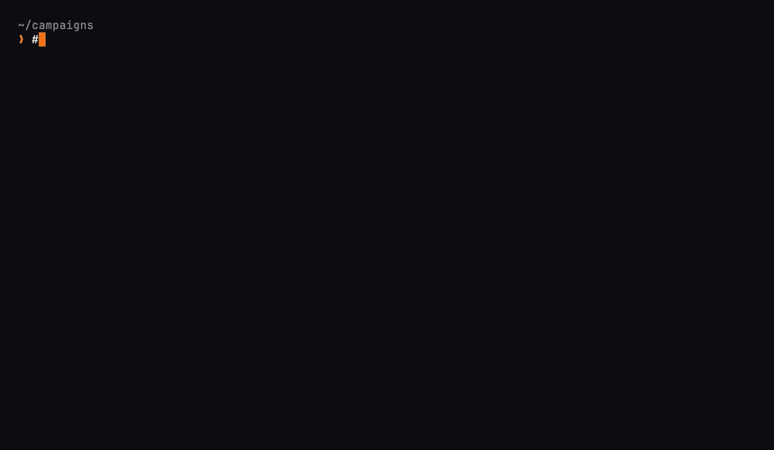

# Festival


<p align="center"><a href="https://github.com/Obedience-Corp/festival"></a></p>

**AI can generate the pieces.<br>Festival keeps the work coherent.**

Hand off a goal, approve the plan, and focus on other work while your agent runs. Come back to results you can trace through the plan, decisions, checks, and commits that produced them.

Festival is an operating environment for long-running agent work. It keeps the context and progress in files and Git, so the work can continue across sessions, agents, and months or years of development.

Use it with Claude Code, Codex, Grok Build, Cursor, OpenCode, or another agent that can read files and run commands. Your agent calls `fest next` for its next step, does the work, and records the result.

[Get started](#get-started) · [Explore the demos](#explore-the-tools) · [Video quick start](https://docs.fest.build/getting-started/quickstart/) · [Website](https://fest.build/) · [简体中文](README.zh-CN.md)

## Four days of agent work, alongside everything else

In the camp-hardening festival, agents worked on safeguards against data loss in the Camp CLI over four days while the operator did other work in parallel. The saved plan and progress let the next agent continue the same work after a tool change. The resulting [safeguards for project removal and worktree cleanup were reviewed and merged](https://github.com/Obedience-Corp/camp/pull/324).

**Drafted by Fathom. Execution started with Grok, finished with Codex.**

<p align="center">
  
</p>

This is a replay of the festival's recorded progress, not a CLI recording. [Read the actual plan and work record](https://github.com/Festival-Examples/example-camp-hardening-festival).

[Try your own handoff](#get-started), or star this repository to keep it handy.

## What would you hand off?

Start with a real outcome that you can review. For example:

- **A feature across repositories:** “Add account deletion to the API and web app. Cover it with tests and document how existing users are affected.”
- **An investigation before a build:** “Investigate why this service slows down under load. Save the evidence, compare the options, and bring me a recommendation before changing production.”
- **A recurring review:** “Review this week's dependency changes, flag compatibility risks, and prepare the updates for my approval.”

The goal, constraints, and success criteria come from you. Your agent works through the plan and returns when it reaches a review point or a decision that needs you.

[Explore the use cases](https://docs.fest.build/use-cases/) · [See example camps and festivals](https://github.com/Obedience-Corp/examples)

## Get started

### 1. Install

Choose one method. Both install `camp`, `fest`, and the `festival` manager. Git is required.

**macOS with Homebrew**

```bash
brew install --cask Obedience-Corp/tap/festival
```

**macOS or Linux with Node.js**

```bash
npm install -g @obedience-corp/festival
```

Then check the install:

```bash
festival doctor
```

[Linux packages, WSL2, and other install methods](https://docs.fest.build/getting-started/installation/). Native Windows support is being hardened; use WSL2 for now.

### 2. Make a camp for your work

A **camp** holds the context for one part of your life: your job, a side project, or a hobby. It can contain several projects, along with their research, plans, and decisions.

Run this from the directory where you keep your work, then answer the prompts for the camp's description and mission:

```bash
camp init my-camp
cd my-camp
```

Link a repository you already use. Replace the path with its full local path:

```bash
camp project link /path/to/your-existing-repo
```

Your repository stays where it is. Camp links it under `projects/` and adds a `.camp` attachment file to the repository. You can also [clone a project into the camp](https://docs.fest.build/cli-reference/camp/camp_project_add/).

Open your coding agent at the camp root, `my-camp/`. The [agent setup guides](https://docs.fest.build/getting-started/agents/) cover skills and integrations for your tool. Skills are optional; the CLI can teach your agent the workflow.

<p align="center">
  
</p>

Watch a camp take shape. This recording uses `camp project add --local`; the instructions above link an existing repository without moving it.

### 3. Give your agent a goal

A **festival** is the structured plan and work record for a goal. For your first run, pick one repository and a bounded change, such as fixing a bug and adding a regression test.

You describe the result; your agent handles the planning commands. Replace the bracketed text and give it this prompt:

> In [project name], I want [specific outcome]. Success means [what I should be able to verify]. Constraints: [scope, compatibility, or other requirements].
>
> Read AGENTS.md and run `fest intro`. Use the fest CLI to plan this as a standard festival. Follow its planning and validation guidance, and link the plan to the project or worktree where you'll do the work.
>
> Ask about missing requirements. Show me the plan, its location, and how you will verify the result. Wait for my approval before implementation, and stop at approval gates as the work progresses.

<p align="center">
  
</p>

A real Grok Build session planning a sample app feature. The agent handles the planning commands; you review the proposed work.

### 4. Run, review, and resume

Review the scope and the checks that will demonstrate success. When you approve the plan, tell your agent:

> The plan is approved. Work from the festival's linked project or worktree. Run `fest next`, follow its instructions, record progress, and repeat. Run the planned checks before marking work complete.
>
> Continue until the goal is complete, or stop for an approval gate, a blocker, or a decision that needs me. Finish with the changes, verification results, and anything I should review.

Your agent runs that loop within its own permissions. You can do other work and return at a review point. Open another terminal in the festival directory and run `fest watch` whenever you want to check progress.

<p align="center">
  
</p>

The progress view you can open alongside your agent. This recording demonstrates the real `fest watch` interface with scripted progress updates in a sample festival.

**If the session ends:** point your next agent at the saved festival and ask it to continue from the linked project. The recorded plan, progress, and decisions give it a starting point.

[Follow the video quick start](https://docs.fest.build/getting-started/quickstart/) to see setup, planning with Grok Build, and the progress view.

## How the work stays coherent

A festival is a **graph of work**, organized into phases, sequences, and tasks. Each task has context and completion criteria. Your agent uses `fest next` to find the next actionable step, does the work, checks the result, and records progress before continuing.

That is the basis for **loop engineering** with Festival: repeatable planning, execution, review, and handoff loops. You can start with a lightweight `WORKFLOW.md`, build a full festival for a larger goal, or run separate festivals with agents in separate worktrees.

The camp holds the context around those goals over the life of the work. Research can inform a design; that design can become a festival; its results and decisions remain available for the next goal.

Quality gates provide places to test and review. `fest validate` checks plan structure, and `fest commit` links commits to festival tasks. You review the actual output and verification evidence before accepting the result.

[Loops & orchestration](https://docs.fest.build/guides/loops-and-orchestration/) · [Festival methodology](https://docs.fest.build/methodology/overview/) · [Work items](https://docs.fest.build/methodology/work-items/)

### Three tools, one work system

| Tool | What it handles |
| --- | --- |
| [camp](https://github.com/Obedience-Corp/camp) | Projects, context, navigation, and the work queue across your camp. |
| [fest](https://github.com/Obedience-Corp/fest) | Goal-based plans, the next-step loop, progress, and review checkpoints. |
| `festival` | Installing and updating the suite, browsing CLI plugins, and checking your installation. |

Run `festival browse` to explore available CLI plugins. See [suite and plugin management](https://docs.fest.build/getting-started/festival-manager/) for installation, updates, and how CLI plugins differ from agent integrations.

## Useful between the big goals, too

- **Jump straight to the work.** `cgo p api` finds a matching project; `cgo f` takes you to festivals. Add the [shell integration](https://docs.fest.build/getting-started/shell-setup/) to enable these shortcuts.
- **Find the next thing to pick up.** `camp workitem` brings intents, research, designs, and festivals into one work queue.
- **Start fresh after a merged PR.** `camp fresh` syncs a project to its default branch and prunes merged branches. Preview with `camp fresh --dry-run` from that project first, including any configured branch creation or follow-up commands.

[Everyday development with cgo and camp fresh](https://docs.fest.build/guides/everyday-development/)

## Explore the tools

Open a section to see the commands in use. The recordings stay on this page, at a readable size.

<details>
<summary>Move between projects, plans, and camps</summary>

`cgo` jumps to a project or planning directory; `csw` switches camps.

<p align="center">
  
</p>

</details>

<details>
<summary>Find work, capture an idea, and sort the inbox</summary>

**Find work across the camp.** `camp workitem` brings intents, research, designs, and festivals into one searchable list.

<p align="center">
  
</p>

**Capture an idea.** `camp intent add` saves it to the inbox for later.

<p align="center">
  
</p>

**Sort the inbox.** `camp intent explore` lets you browse intents by status and read their details.

<p align="center">
  
</p>

</details>

<details>
<summary>See which festivals are active and inspect a plan</summary>

`fest list` groups festivals by status, so you can see what's active, ready, or still being planned.

<p align="center">
  
</p>

`fest show` opens the structure of a plan, from its phases down to individual tasks.

<p align="center">
  
</p>

</details>

<details>
<summary>Add testing and review gates to a plan</summary>

`fest gates apply` previews the quality gates it will add before applying them with approval.

<p align="center">
  
</p>

</details>

<details>
<summary>Review old work and clear space for what's next</summary>

`camp dungeon crawl` walks through stale work so you can choose what to keep or archive.

<p align="center">
  
</p>

</details>

<details>
<summary>Watch a longer Festival session</summary>

An earlier Festival workflow recording at 16× playback speed. Use the setup instructions above for the current first-run path.

<p align="center">
  <a href="https://youtu.be/FY6vm74oa8o"></a>
</p>

</details>

[More video walkthroughs and demos](https://docs.fest.build/videos/)

## Fits the tools you already use

**Can I keep my issue tracker?**

Yes. Keep issues where your team coordinates, and use Festival for the agent's plan and work record. Intents and other work items live in files, so scripts or justfiles can connect them to an external service's API. Ask your agent to help build the connection you need. [See the workflow](https://docs.fest.build/compare/festival-vs-issue-trackers/).

**Can I change agents partway through?**

Yes. The next agent can read the same saved plan, decisions, and progress. Give it the festival location and access to the linked project. [Agent handoff guide](https://docs.fest.build/use-cases/ai-agent-handoff/).

**Do I need a Festival account?**

The CLI tools are free to use and run locally without a Festival account. Your agent's account, model costs, and permissions remain with the provider you choose.

## Keep going

- [Documentation](https://docs.fest.build/): guides, use cases, and CLI reference.
- [First festival tutorial](https://docs.fest.build/tutorials/first-festival/): a hands-on walkthrough of the plan structure.
- [Examples](examples/) and [templates](templates/): work you can inspect and adapt.
- [Plugin authoring](https://docs.fest.build/guides/plugin-authoring/): extend `camp` and `fest` with your own commands.
- [Report a bug or request a feature](https://github.com/Obedience-Corp/festival/issues): tell us what happened or what would help.
- [Give feedback](https://fest.build/feedback/) or [read the blog](https://fest.build/blog/).

**Festival App is in development.** The CLI tools are available now. [See what's coming](https://fest.build/#app).

If Festival is useful to you, **star this repository** to help other developers discover it. A bug report, a workflow you share, or an example of work you've handed off helps us improve it.

[Apache License 2.0](LICENSE) · Built by [Obedience Corp](https://obediencecorp.com/).
