# Festival

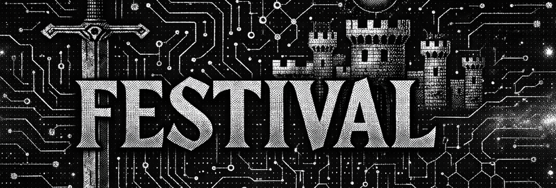

<p align="center"><a href="https://github.com/Obedience-Corp/festival/stargazers"></a></p>

<p align="center"><strong>Your files. Any agent.</strong></p>

**A standardized workspace and workflow for solving difficult, multi-faceted problems with AI.**

To use AI to solve hard problems you need three things: **context**, **direction**, and **verification**. Festival provides a structured layer for each, resulting in dramatically fewer tokens and less time spent getting to the outcome you want.

Festival is the planning and verification layer for long-running agent work. The campaign is files you own. The harness is whatever you already run. The next session starts from `fest next` instead of from a re-explained prompt.

> [Get started](https://docs.fest.build/getting-started/quickstart) (takes ~5 minutes).

<p align="center">
  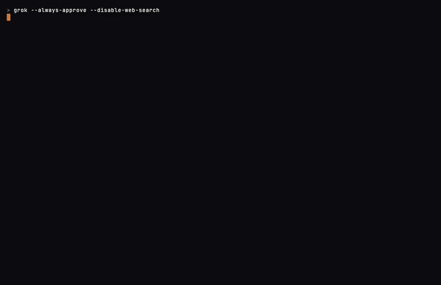
</p>

<p align="center"><em>Describe the work in a sentence. Your agent scaffolds the design and plans the whole festival: phases, sequences, and tasks. Then the <code>fest next</code> loop executes it.</em></p>

<p align="center"><strong>Battle-tested daily:</strong> Obedience Corp plans and ships its own products with Festival.</p>

## Common Questions

**Is this a coding agent?**

No. Keep Claude Code, Codex, Grok, or whatever you already run. Festival is the work system those agents read and write.

**Where does the memory live?**

In your campaign: phases, sequences, tasks, intents, and git history, as plain files in directories you own. You can copy it, diff it, and leave with it.

**What happens when a session ends?**

The next actionable task is still on disk. `fest next` is the resume, in the same harness or a different one.

**How do you know the work is done?**

Each task carries completion criteria, `fest validate` checks the plan against the methodology, quality gates run at the end of a sequence, and `fest commit` ties the change back to the task it came from. That trail is the proof of work.

**Do I need an account or a hosted service?**

No. `camp`, `fest`, and `festival` are local binaries. Everything they write is a file in your workspace, and nothing is routed through Obedience Corp. Bring your own models and your own agent. See [how Festival compares](https://docs.fest.build/compare/) to hosted agent workspaces.

<p align="center">
  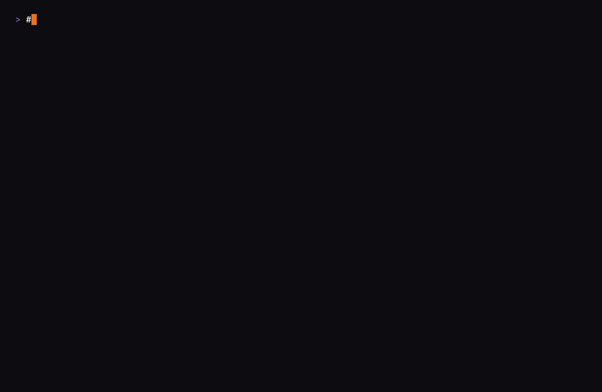
</p>
<p align="center"><em>One sentence of intent. A scaffolded festival. The agent runs the next task, the session is interrupted, and <code>fest next</code> picks it back up. Validate, commit, done.</em></p>

## Install

Every method below installs three binaries: `camp`, `fest`, and `festival`.
`festival` installs, updates, and launches the other two; it verifies signed
package metadata against a compiled-in key and refuses unsigned content by
default.

```bash
festival install festival  # install the suite (camp, fest, and festival)
festival update            # keep camp, fest, and festival in sync
festival browse            # see what is available
festival doctor            # check the install
```

**npm / pnpm / bun:**

```bash
npm install -g @obedience-corp/festival
```

**macOS:**

```bash
brew install --cask Obedience-Corp/tap/festival
```

**Arch Linux:**

```bash
yay -S festival-bin
```

**Debian/Ubuntu:** Download `.deb` from [releases](https://github.com/Obedience-Corp/festival/releases/latest)

**Windows:** Stable Windows packages are temporarily paused while support is being hardened.
For now, use WSL2 and the Linux install method above.

## Requirements

- `git` is required. `camp` and `fest` use git internally for campaign init, project management, template sync, and commit-aware workflows.
- `scc` is recommended but optional. Without it, `camp leverage` features will not work.

## Quick Start

```bash
# Shell integration (add one setup path to ~/.zshrc)

# Preferred when installed with install.sh:
source ~/.local/share/festival/shell/festival.zsh

# Or, if no helper file is installed:
eval "$(camp shell-init zsh)"
eval "$(fest shell-init zsh)"

# Finding the installed binaries:
# After shell-init, `camp` and `fest` are shell functions so they can `cd`.
# Plain `which camp` / `which fest` prints the function, not a path.
# Use:  whence -p camp   # zsh external binary
#       whence -p fest
#       type -P camp     # bash
#       type -a camp     # function + every PATH binary
#       realpath "$(whence -p camp)"
# Or run the binary directly: command camp version

# Create a campaign
camp init my-project && cd my-project

# Add a project
camp project add https://github.com/you/your-repo

# Create your first festival
fest create festival --name "my-first-feature" --type standard

# Fill the generated REPLACE markers in the new festival files
# Then validate before execution
fest validate

# Start working
fest next
```

After installing, see the [quick start guide](https://docs.fest.build/getting-started/quickstart/) for shell setup and first steps.

## See It in Action

`camp` and `fest` are terminal-native. Here is what the core commands actually look like.

<table>
  <tr>
    <td align="center" width="33%">
      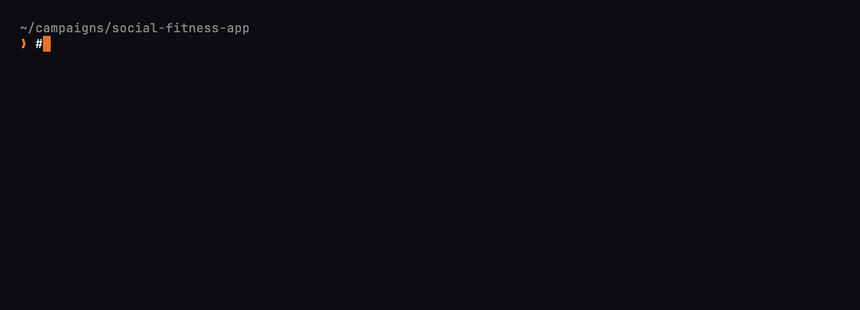<br>
      <sub><b><code>cgo</code></b><br>Jump anywhere in the workspace</sub>
    </td>
    <td align="center" width="33%">
      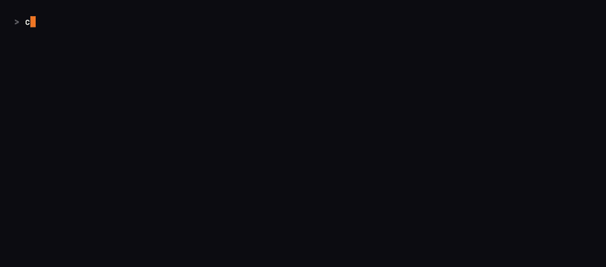<br>
      <sub><b><code>camp wi</code></b><br>One queue for every kind of work</sub>
    </td>
    <td align="center" width="33%">
      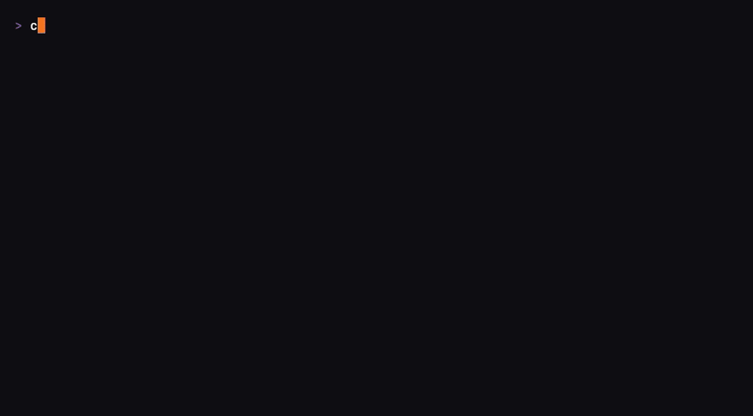<br>
      <sub><b><code>camp intent add</code></b><br>Capture an idea in seconds</sub>
    </td>
  </tr>
  <tr>
    <td align="center" width="33%">
      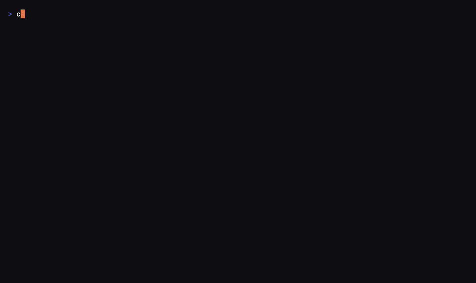<br>
      <sub><b><code>camp intent explore</code></b><br>Browse and triage the inbox</sub>
    </td>
    <td align="center" width="33%">
      <br>
      <sub><b><code>fest list</code></b><br>Every festival, grouped by status</sub>
    </td>
    <td align="center" width="33%">
      <br>
      <sub><b><code>fest show</code></b><br>Read a plan's full structure</sub>
    </td>
  </tr>
  <tr>
    <td align="center" width="33%">
      <br>
      <sub><b><code>fest watch</code></b><br>Watch progress update live</sub>
    </td>
    <td align="center" width="33%">
      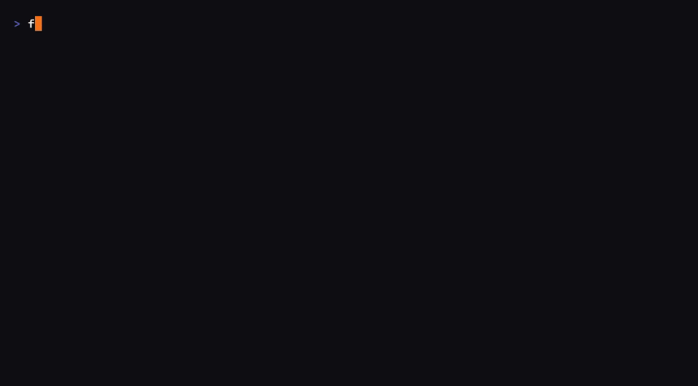<br>
      <sub><b><code>fest gates apply</code></b><br>Add quality gates in one command</sub>
    </td>
    <td align="center" width="33%">
      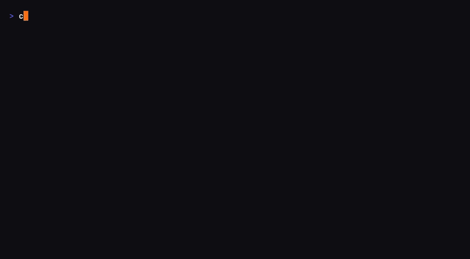<br>
      <sub><b><code>camp dungeon crawl</code></b><br>Triage stale work into the dungeon</sub>
    </td>
  </tr>
</table>

<p align="center"><strong>A 4-day festival, planned and built across three AI tools</strong></p>
<p align="center"><em>Planned in Claude Code (Fathom), promoted to active, then the <code>fest next</code> loop ran in grok-build, stopped 2 days in, and finished in Codex.</em></p>

<p align="center">
  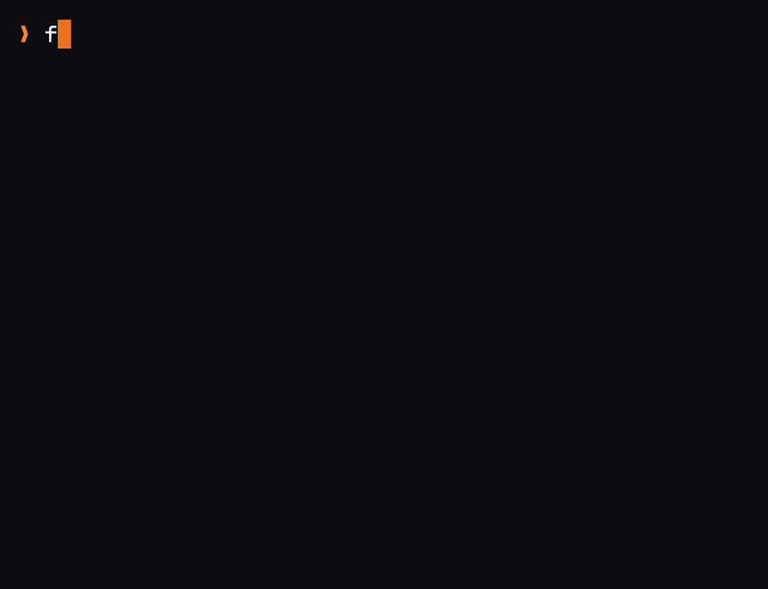
</p>

<p align="center"><em><a href="https://github.com/Festival-Examples/example-camp-hardening-festival">See the festival behind this demo &rarr;</a></em></p>

## The Problem

If you work on more than a few things at once, staying organized becomes a job of its own.

Your work spreads across repositories, documents, chats, notes, bookmarks, and AI conversations. Finding where something belongs becomes work. Remembering what you were doing becomes work. Switching between efforts becomes work.

AI makes this harder, not easier. It generates plans, code, research, and tasks faster than you can file them. The bottleneck moves from producing work to organizing it.

So every new AI session starts from zero. No memory of the larger goal, no structure for multi-step work, no way to pick up where you left off. You re-explain the same context, get inconsistent results, and lose coherence across sessions.

Festival is the organizational layer for work done with AI. Instead of asking "where should this go?" you put it in the campaign it belongs to. Instead of asking "what was I working on?" you resume the campaign. To turn that organization into outcomes, Festival gives every mission three things:

1. **Context**: a workspace that holds all projects, docs, and planning for a mission in one place
2. **Direction**: structured plans that AI agents can pick up, execute, and resume without losing the thread
3. **Verification**: completion criteria and reviewable output baked into the workflow, not bolted on after

## What Festival Does

Festival ships as a three-binary suite (`camp`, `fest`, and `festival`) that solves the three problems above.

**`camp`** manages campaigns: isolated workspaces that hold all the projects, docs, research, and planning for a single mission, a high-level purpose like your startup, your job, or a hobby. A mission grows over time, and the campaign grows with it. It gives you instant navigation across everything in the workspace, project lifecycle management, and shell shortcuts that make `cd` obsolete.

Work items are the campaign-level work queue. `camp workitem` surfaces intents, design docs, explore notes, festivals, and custom tracked work through one dashboard. It can mark current work, link work to projects or festivals, and commit changes scoped to the resolved work item.

**`fest`** manages festivals: structured plans that break work into phases, sequences, and tasks. The hierarchy is designed for AI agents to execute autonomously, pause, and resume without context loss. Run `fest next` and the agent gets its next task with full surrounding context. Run `fest commit` and every commit traces back to the plan.

**`festival`** installs, updates, and launches `camp` and `fest` as a matched pair. `festival browse` shows what is available across registered marketplaces, `festival update` moves all three binaries together, and `festival doctor` reports the installer's view of your PATH, sources, and receipts. It verifies signed package metadata against a compiled-in key and refuses unsigned content by default.

### Where Festival Fits

Festival is a **planning and context layer**, not a runtime orchestrator. It doesn't spawn agents or manage their processes. It gives them the structure, context, and goals they need to work autonomously. Runtime orchestrators tell agents what to do next. Festival tells agents *why* they're doing it, what success looks like, and where they are in a larger mission.

The context model is persistent and filesystem-based. Plans survive across sessions, days, and weeks, not just a single agent run. Festival is agent-agnostic: it works with Claude Code, Codex, Aider, OpenCode, or any CLI tool that can read files and run commands. Use an orchestrator to manage parallel agents, and Festival to give each agent the plan and context it needs.

### How Festival Compares

Most tools in this space are spec generators (spec-kit), task managers (Task Master), persona workflow packs (BMAD), or static instruction files (CLAUDE.md / AGENTS.md). Festival overlaps all of them but operates a level up: at the mission, not the feature.

| | Scope | What persists between sessions |
|---|---|---|
| **Festival** | A mission: many features, many repos | The whole workspace: plans, context, decisions, and an audit trail in git |
| **Spec-driven tools** | One feature spec at a time | The spec and its task list |
| **Task managers** | One PRD broken into tasks | Task list state |
| **Instruction files** | Static per-repo guidance | Instructions only, no execution state |

The practical differences: festivals survive across sessions, days, and tools (plan in Claude Code, execute in Codex, finish somewhere else), every step lands in git as a traceable commit, and quality gates plus approval judges are part of the plan rather than bolted on afterward. If the work fits in one prompt or one feature spec, simpler tools are the right call. Festival is for when the work is bigger than a session.

### Festival Methodology

Festival is built around Festival Methodology: a hierarchical, goal-based planning system for human-directed AI execution. It preserves both agent context and operator context, uses ingest and planning phases to reduce chat iteration up front, and leaves a durable pre- and post-execution audit trail so you can scale difficult knowledge work without micromanaging every decision. Read the full methodology guide in the [`fest` repo](https://github.com/Obedience-Corp/fest/blob/main/methodology/README.md).

### Real Example

Here's what `obey-campaign` looks like, a real campaign that orchestrates Obedience Corp's internal platform and product stack:

```
obey-campaign/
├── projects/                     # 32 project submodules
│   ├── camp/                     # Campaign CLI
│   ├── fest/                     # Festival planning CLI
│   ├── festival/                 # Distribution repo (this one)
│   ├── obey-platform-monorepo/   # Core platform
│   ├── obey-chat/                # Chat client
│   ├── guild-core/               # Reference implementation
│   ├── obediencecorp.com/        # Company website
│   ├── prototypes/               # Experiment sandbox
│   └── ...                       # 24 more projects
├── festivals/                    # Festival lifecycle workspace
│   ├── planning/                 # Festivals being designed
│   ├── active/                   # Currently executing
│   ├── ready/                    # Prepared, awaiting execution
│   ├── ritual/                   # Recurring processes
│   ├── chains/                   # Linked festival workflows
│   └── dungeon/                  # completed/ | archived/ | someday/
├── .campaign/                    # Campaign state and work queue
│   ├── intents/                  # Captured ideas, bugs, and future work
│   ├── quests/                   # Long-lived working contexts
│   └── workitems/                # Tracked work-item metadata
├── workflow/                     # Design docs, explore notes, code reviews, pipelines
├── ai_docs/                      # AI research and documentation
├── docs/                         # Human-authored documentation
└── CLAUDE.md                     # Agent instructions
```

Every project, every plan, every piece of context for this mission lives here. `cgo p fest` jumps to the fest project. `fgo` toggles between a festival and its linked project. Everything is navigable by both humans and AI agents.

## Agentic Loops

Festival is built to be run as a loop: you point an agent at a plan, and it works the plan one step at a time, committing as it goes, until the work is done. The same loop scales from a single checklist to an orchestration across many projects.

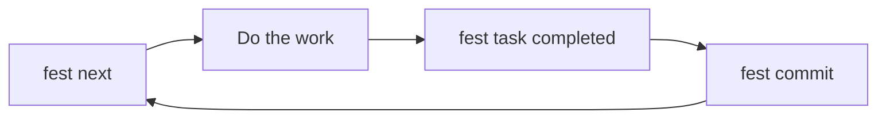
```mermaid
graph LR
    A[fest next] --> B[Do the work]
    B --> C[fest task completed]
    C --> D[fest commit]
    D --> A
```

`fest next` is the entry point: it resolves the next task with context from every level of the hierarchy, the agent does the work, `fest commit` records it, and the loop repeats until the festival is complete.

You start a loop with a prompt that points the agent at the work and tells it to run the loop:

> Navigate to `<linked project or worktree>` and run the fest next loop.

> Navigate to `<festival path>`, run `fest go` to jump to its linked working directory, then run the fest next loop there.

> Open `<path to a standalone WORKFLOW.md>` and run the fest next loop.

The same machinery runs at three scales, smallest first:

- **A standalone `WORKFLOW.md`** drives an ordered, repeatable process (a review, a release checklist) step by step with `fest next`.
- **A festival** drives complex, multi-step work through phases, sequences, and tasks with quality gates. Plan it from the festival directory; implement it from the festival's linked project or worktree (`fest go` toggles between the two).
- **An agent orchestration loop** reads the `camp workitem` queue and fans work out across projects, spinning up subagents and worktrees per item. Here the agent is the loop, not `fest next`:

> List the ready work items with `camp workitem --json`, and for each one create a worktree, dispatch a subagent to implement it, and open a PR.

Full guide: **[Loops & Orchestration](https://docs.fest.build/guides/loops-and-orchestration/)**. See a complete worked festival, plan to execution, in the [examples](https://github.com/Obedience-Corp/examples).

## Navigation

Shell integration gives you shorthand functions that make navigating a campaign instant. Package installs include helper files that load `camp` and `fest` shell functions plus tab completion for all three binaries:

```bash
# install.sh default location
source ~/.local/share/festival/shell/festival.zsh

# Homebrew
source "$(brew --prefix)/share/festival/shell/festival.zsh"

# Linux packages
source /usr/share/festival/shell/festival.zsh
```

For bash, use `festival.bash`; for fish, use `festival.fish`. If no helper file is installed, use the dynamic fallback:

```bash
eval "$(camp shell-init zsh)"   # gives you: cgo, cr, csw, cint
eval "$(fest shell-init zsh)"   # gives you: fgo, fls
```

Replace `zsh` with `bash` or `sh`, or pipe the `fish` output to `source`. Use
`sh` for dash, busybox ash, and any other Bourne shell that is neither bash nor
zsh; the helpers work there, only tab completion is unavailable.

### Finding the installed binaries

Shell integration defines `camp` and `fest` as **shell functions** so navigation
commands can `cd` in your current shell. Because of that, plain `which camp` /
`which fest` usually prints the function body, not a filesystem path.

```bash
# zsh: path of the external binary (skips shell functions)
whence -p camp
whence -p fest
# or: which -p camp / which -p fest

# bash
type -P camp
type -P fest

# show the function plus every binary on PATH
type -a camp
type -a fest

# resolve symlinks to the real install
realpath "$(whence -p camp)"   # zsh
realpath "$(type -P camp)"     # bash
```

To run a binary without the wrapper (scripts, debugging): `command camp version`
or `command fest version`.

### cgo: jump anywhere in your workspace

`cgo` wraps `camp go` with real `cd` behavior. It's the fastest way to move around:

```bash
cgo                   # Toggle between campaign root and last location
cgo p                 # Jump to projects/
cgo p api             # Fuzzy-find "api" in projects/ (matches api-server, api-gateway, etc.)
cgo f                 # Jump to festivals/
cgo w                 # Jump to workflow/
cgo wt api@feat       # Jump to a worktree branch
```

Category shortcuts (`p`, `f`, `w`, `a`, `d`, `i`, `wt`, `du`, `cr`, `de`) map to common campaign locations (`i` jumps to `.campaign/intents/`, `de` to `workflow/design/`, and so on). After the category, any additional argument is a fuzzy search. `cgo p mono` lands you in `obey-platform-monorepo/`. Tab completion works at every level.

You can also run a command without leaving your current directory:

```bash
cgo -c p api ls       # Run ls inside projects/api-* without cd'ing
cr just build         # Run "just build" from campaign root
```

### fgo: toggle between a festival and its linked project

`fgo` wraps `fest go`. Its standout feature is bidirectional toggling:

```bash
fgo                   # From a festival -> jump to its linked project
                      # From a linked project -> jump back to the festival

fgo 2                 # Jump to phase 002
fgo 2/1               # Jump to phase 2, sequence 1
fgo active            # Jump to festivals/active/
fgo active my-fest    # Jump to a specific active festival
```

Link a festival to a project once (`fgo link`) and `fgo` with no args toggles between them forever. Named shortcuts work too: `fest go map n` bookmarks the current directory, then `fgo -n` jumps there.

### Other shorthands

| Shorthand | Expands to | What it does |
|-----------|------------|--------------|
| `csw`     | `camp switch` | Switch between campaigns (fuzzy match + interactive picker) |
| `cint`    | `camp intent add` | Quick-capture an idea to the intent inbox |
| `cr`      | `camp run` | Run a command from campaign root |
| `fls`     | `fest list` | List festivals by status |

### Concept shortcuts

`camp` supports shorthand for subcommands too. `camp p` expands to `camp project`, so these are identical:

```bash
camp p commit -m "fix bug"    # Same as: camp project commit -m "fix bug"
camp p add <url>              # Same as: camp project add <url>
camp p list                   # Same as: camp project list
```

## CLI Overview

Full reference: [fest CLI](https://docs.fest.build/cli-reference/fest/) | [camp CLI](https://docs.fest.build/cli-reference/camp/) | [festival CLI](https://docs.fest.build/cli-reference/festival/)

### camp: workspace management

```bash
camp init my-startup             # Create a campaign
camp project add <url>           # Add a project as submodule
camp p commit -m "fix auth"      # Commit in a project (auto-stages all changes)
camp workitem                    # Dashboard across intents, designs, explore docs, festivals
camp workitem current my-feature # Mark the current work item
camp workitem commit -m "msg"    # Commit changes scoped to the resolved work item
camp status all                  # Dashboard of all project statuses
camp doctor                      # Health check the workspace
camp intent add "idea"           # Capture an idea to the inbox
camp leverage                    # Measure productivity leverage across projects
```

### fest: planning and execution

```bash
fest create festival --name "my-feature" --type standard  # Scaffold the beginner path
fest next                        # Get the next task with layered context (festival -> phase -> sequence -> task)
fest task completed              # Mark the current task done
fest workflow advance            # Complete a workflow step and move to the next
fest status                      # View progress across all levels
fest commit -m "implement auth"  # Git commit with automatic festival/task reference
fest understand                  # Teach an AI agent the full methodology
```

`fest next` is the entry point for agents: it resolves the next task with context from every level of the hierarchy and respects workflow ordering and completion criteria. See [Agentic Loops](#agentic-loops) for how it drives execution end to end.

### festival: suite installer and updater

```bash
festival install festival  # install the suite (camp, fest, and festival)
festival update            # keep camp, fest, and festival in sync
festival browse            # see what is available across marketplaces
festival doctor            # report PATH, sources, and receipts
festival which camp        # resolve the real binary path for a suite tool
festival version           # print the festival manager version
```

`festival` is not part of the day-to-day agentic loop; `fest` and `camp` are. It exists to get those two installed correctly and keep them current.

## Claude Code Plugin

Install the Festival plugin for Claude Code to get `fest` and `camp` CLI tools, slash commands, methodology skills, and specialized agents in one step:

```bash
claude plugin add --source git-subdir --url Obedience-Corp/festival --path claude-plugin
```

If `fest` and `camp` aren't already installed, the plugin installs them automatically on first session. It also checks for updates once per day and notifies you when a new release is available.

Building a Camp or Fest plugin? See the [plugin authoring guide](docs/guides/plugin-authoring.md).
The basic model is the same as Git plugins: put a `camp-<name>` or `fest-<name>`
executable on your `PATH`.

### What you get

| Component | Examples |
|-----------|---------|
| **Slash commands** | `/fest-next`, `/fest-create`, `/fest-commit`, `/fest-validate`, `/fest-status`, `/camp-intent`, `/camp-init` |
| **Skills** | Auto-activating methodology knowledge, execution workflows, planning guidance |
| **Agents** | `fest-planner` for designing festivals, `fest-executor` for working through tasks |

## Updating Templates After Upgrades

Festival releases may include updated methodology files, agents, examples, and templates. Upgrading the `fest` binary does not automatically rewrite those files because users often customize their `.festival/` methodology directory and template files.

When a release includes template changes, update in two explicit steps:

```bash
# Refresh the local system template cache
fest system sync

# Preview campaign methodology/template changes before applying them
fest system update --dry-run

# Apply interactively, or create backups before updating
fest system update
fest system update --backup
```

Use `fest system update --force` only when you intentionally want to overwrite local changes. The manual update flow protects customized templates from accidental replacement.

## Documentation

Full documentation at **[docs.fest.build](https://docs.fest.build)**:

- [Methodology Overview](https://docs.fest.build/methodology/overview/): core principles and concepts
- [Agent Workflows](https://docs.fest.build/guides/agent-workflows/): using Festival with AI coding tools
- [Work Items](https://docs.fest.build/methodology/work-items/): campaign-level work discovery, current work, links, and scoped commits
- [First Festival Tutorial](https://docs.fest.build/tutorials/first-festival/): end-to-end walkthrough
- [CI Integration](https://docs.fest.build/tutorials/ci-integration/): release smoke ownership and launch-path verification

Repository entry points:

- [README.zh-CN.md](README.zh-CN.md): Simplified Chinese overview for Chinese developers
- [Example campaigns & festivals](https://github.com/Obedience-Corp/examples): real, cloneable example campaigns and festivals to read and run
- [Examples](examples/): before/after shapes for resumable AI coding work
- [Templates](templates/): reusable planning scaffolds for AI-assisted feature work

### Watch

<p align="center">
  <a href="https://youtu.be/FY6vm74oa8o?si=ZFg87vA7u9G_79bX">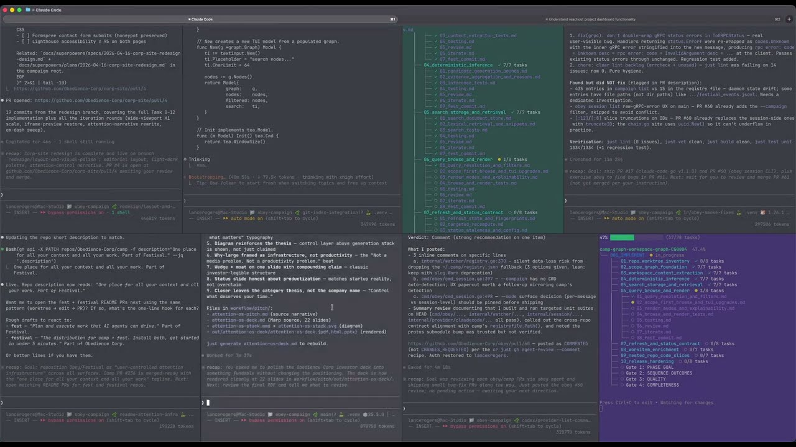</a>
</p>

<p align="center"><em><a href="https://docs.fest.build/videos/">More walkthroughs, demos, and speed runs &rarr;</a></em></p>

<p align="center"><strong>Find Festival useful?</strong> <a href="https://github.com/Obedience-Corp/festival">Star the repo</a> so others can find it.</p>

## License

[Apache License 2.0](LICENSE)

Built by [Obedience Corp](https://obediencecorp.com). AI that does what you want, the way you want it done.
