# Festival

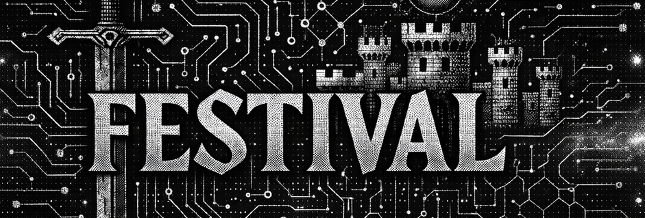

<p align="center"><a href="https://github.com/Obedience-Corp/festival"></a></p>

**Festival is a vibe engineering framework.**

It is vibe coding for production software. You describe the goal in a sentence. Your agent plans it, and `fest next` runs it. The plan, the checks, and the commits stay in files and Git when the session ends.

A camp is the workspace. A festival is one long goal inside it. Use it with Claude Code, Codex, Grok Build, Cursor, OpenCode, or another agent that can read files and run commands.

[Get started](#get-started) · [Explore the demos](#explore-the-tools) · [Video quick start](https://docs.fest.build/getting-started/quickstart/) · [Website](https://fest.build/) · [Discord](https://discord.gg/Rt7dDY6VqD) · [简体中文](README.zh-CN.md)

## See Festival in action

Three completed festivals built the [CodeSignal Practice Simulator](https://github.com/Festival-Examples/codesignal-practice-simulator).
Agents followed the `fest next` loop, with testing and review gates feeding
findings back into fixes. The demo repository includes the plans, tasks,
review findings, and verification evidence for each build.

<p align="center">
  <a href="https://github.com/Festival-Examples/codesignal-practice-simulator/tree/main/festivals/codesignal-browser-assessment-simulator-CB0001"></a>
</p>

[Explore the demo](https://github.com/Festival-Examples/codesignal-practice-simulator) ·
[Inspect the three festivals](https://github.com/Festival-Examples/codesignal-practice-simulator/tree/main/festivals) ·
[Watch all three replays](https://github.com/Festival-Examples/codesignal-practice-simulator#how-this-was-built)

[Try your own handoff](#get-started), or star this repository to keep it handy.

## What would you hand off?

Start with a real outcome that you can review. For example:

- **A feature across repositories:** “Add account deletion to the API and web app. Cover it with tests and document how existing users are affected.”
- **An investigation before a build:** “Investigate why this service slows down under load. Save the evidence, compare the options, and bring me a recommendation before changing production.”
- **A recurring review:** “Review this week's dependency changes, flag compatibility risks, and prepare the updates for my approval.”

The goal, constraints, and success criteria come from you. Your agent works through the plan and returns when it reaches a review point or a decision that needs you.

[Explore the use cases](https://docs.fest.build/use-cases/) · [See example camps and festivals](https://github.com/Obedience-Corp/examples)

## Get started

### 1. Install

Choose one method. Both install `camp`, `fest`, and the `festival` manager. Git is required.

**macOS with Homebrew**

```bash
brew install --cask Obedience-Corp/tap/festival
```

**macOS or Linux with Node.js**

```bash
npm install -g @obedience-corp/festival
```

Then check the install:

```bash
festival doctor
```

[Linux packages, WSL2, and other install methods](https://docs.fest.build/getting-started/installation/). Native Windows support is being hardened; use WSL2 for now.

### 2. Make a camp for your work

A **camp** holds the context for one part of your life: your job, a side project, or a hobby. It can contain several projects, along with their research, plans, and decisions.

After installing, create a camp:

```bash
camp create my-camp
camp create work
csw my-camp
csw work
```

`camp create` puts each camp in `~/campaigns/` and asks for a description and mission. `csw` is the shorthand for `camp switch` and moves your shell from one camp to the other. Add the [shell integration](https://docs.fest.build/getting-started/shell-setup/) so the shorthand exists. With no name, `csw` opens the picker.

<p align="center">
  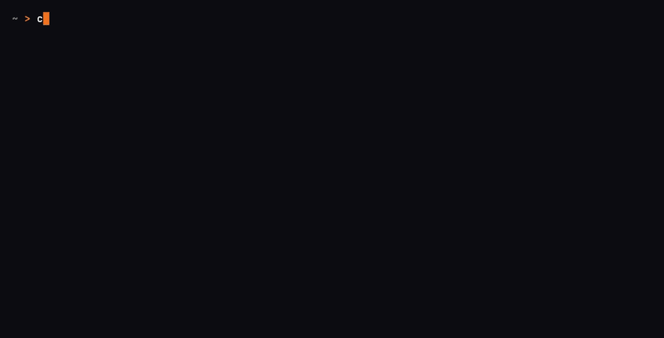
</p>

One recording, in a fresh demo home. On your machine the camps are at `~/campaigns/my-camp` and `~/campaigns/work`.

If an agent is already open, paste this. It installs Festival when `camp` is missing, updates `camp`, `fest`, and `festival` together, creates the camp, and adds the shell hook. Open a new terminal and run `csw <name>` to enter the camp.

```text
If `camp` is missing, install Festival, then run `festival doctor`. On macOS with Homebrew, use `brew install --cask Obedience-Corp/tap/festival`. On macOS or Linux with Node.js, use `npm install -g @obedience-corp/festival`.

To update camp, fest, and festival together, run `festival update`. Do not pass `--force`.

Ask me for a camp name, a one-line description, and a mission. Create the camp with `camp create <name> -d "<description>" -m "<mission>"`. The camp is at `~/campaigns/<name>`. Read `camp create --help` before adding flags. Use `camp create` for this. Do not run `camp init` or `festival setup`.

After Festival is installed, add the shell hook with the installer. Detect my shell and run one of `festival shell-init zsh --append --yes`, `festival shell-init bash --append --yes`, or `festival shell-init fish --append --yes`. Pass `--yes`. Without it, and with no terminal to answer, the installer writes nothing. The command skips the edit when the hook is already there. Then tell me to open a new terminal and run `csw <name>`. You can keep working in `~/campaigns/<name>`.

Skills are optional. The CLI can teach you the workflow.
```

Open your coding agent at that camp root. The [agent setup guides](https://docs.fest.build/getting-started/agents/) cover skills and integrations for your tool. Skills are optional; the CLI can teach your agent the workflow.

Link a repository you already use. Replace the path with its full local path:

```bash
camp project link /path/to/your-existing-repo
```

Your repository stays where it is. Camp links it under `projects/` and adds a `.camp` attachment file to the repository. You can also [clone a project into the camp](https://docs.fest.build/cli-reference/camp/camp_project_add/).

### 3. Give your agent a goal

A **festival** is the structured plan and work record for a goal. Tell your agent what you want done and ask it to create a festival for the work:

> I want [what you want done]. Create a festival for it and run the `fest next` loop.

<p align="center">
  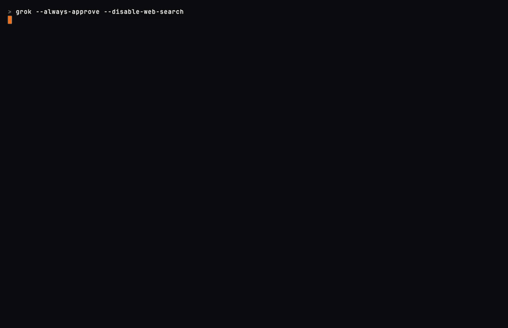
</p>

A real Grok Build session planning a sample app feature. The agent handles the planning commands; you review the proposed work.

### 4. Follow progress and review the result

Your agent handles planning and execution, asking you when it reaches an approval point or needs a decision. You can focus on other work and review the results when they're ready.

To check progress along the way, open another terminal in the festival directory and run `fest watch`.

<p align="center">
  
</p>

The progress view you can open alongside your agent. This recording demonstrates the real `fest watch` interface with scripted progress updates in a sample festival.

**If the session ends:** point your next agent at the saved festival and ask it to continue from the linked project. The recorded plan, progress, and decisions give it a starting point.

[Follow the video quick start](https://docs.fest.build/getting-started/quickstart/) to see setup, planning with Grok Build, and the progress view.

## Share a festival replay

`fest gif` turns recorded festival progress into a GIF you can send and share:

```bash
fest gif my-festival -o replay.gif
fest gif --festival MF0001 --speed 2
```

When a festival moves to completed, Fest creates `festival-replay.gif` and embeds
it in `FESTIVAL_OVERVIEW.md`, with both files included in the completion commit.
Use `fest gif --embed` to refresh it or add a replay to an older festival.

See the [replay guide](https://docs.fest.build/guides/festival-replays/) for
examples, sharing, and recovery.

## How the work stays coherent

A festival is a **graph of work**, organized into phases, sequences, and tasks. Each task has context and completion criteria. Your agent uses `fest next` to find the next actionable step, does the work, checks the result, and records progress before continuing.

That is the basis for **loop engineering** with Festival: repeatable planning, execution, review, and handoff loops. You can start with a lightweight `WORKFLOW.md`, build a full festival for a larger goal, or run separate festivals with agents in separate worktrees.

The camp holds the context around those goals over the life of the work. Research can inform a design; that design can become a festival; its results and decisions remain available for the next goal.

Quality gates provide places to test and review. `fest validate` checks plan structure, and `fest commit` links commits to festival tasks. You review the actual output and verification evidence before accepting the result.

[Loops & orchestration](https://docs.fest.build/guides/loops-and-orchestration/) · [Festival methodology](https://docs.fest.build/methodology/overview/) · [Work items](https://docs.fest.build/methodology/work-items/)

### Three tools, one work system

| Tool | What it handles |
| --- | --- |
| [camp](https://github.com/Obedience-Corp/camp) | Projects, context, navigation, and the work queue across your camp. |
| [fest](https://github.com/Obedience-Corp/fest) | Goal-based plans, the next-step loop, progress, and review checkpoints. |
| `festival` | Installing and updating the suite, browsing CLI plugins, and checking your installation. |

Run `festival browse` to explore available CLI plugins. See [suite and plugin management](https://docs.fest.build/getting-started/festival-manager/) for installation, updates, and how CLI plugins differ from agent integrations.

## Useful between the big goals, too

- **Jump straight to the work.** `cgo p api` finds a matching project; `cgo f` takes you to festivals. Add the [shell integration](https://docs.fest.build/getting-started/shell-setup/) to enable these shortcuts.
- **Switch camps.** `camp switch` moves between registered camps. `csw` is the shorthand.
- **Find the next thing to pick up.** `camp workitem` brings intents, research, designs, and festivals into one work queue.
- **Start fresh after a merged PR.** `camp fresh` syncs a project to its default branch and prunes merged branches. Preview with `camp fresh --dry-run` from that project first, including any configured branch creation or follow-up commands.

[Everyday development with cgo and camp fresh](https://docs.fest.build/guides/everyday-development/)

## Explore the tools

The GIFs play on this page at a readable size.

<details open>
<summary>Move between projects, plans, and camps</summary>

`cgo` jumps to a project or planning directory. `camp switch` moves between camps, and `csw` is the shorthand.

<p align="center">
  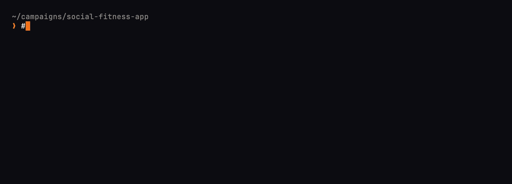
</p>

</details>

<details open>
<summary>See your camps and the projects inside one</summary>

`camp list` browses registered camps by org. Move through them, change a camp's status, and filter down to the active ones.

<p align="center">
  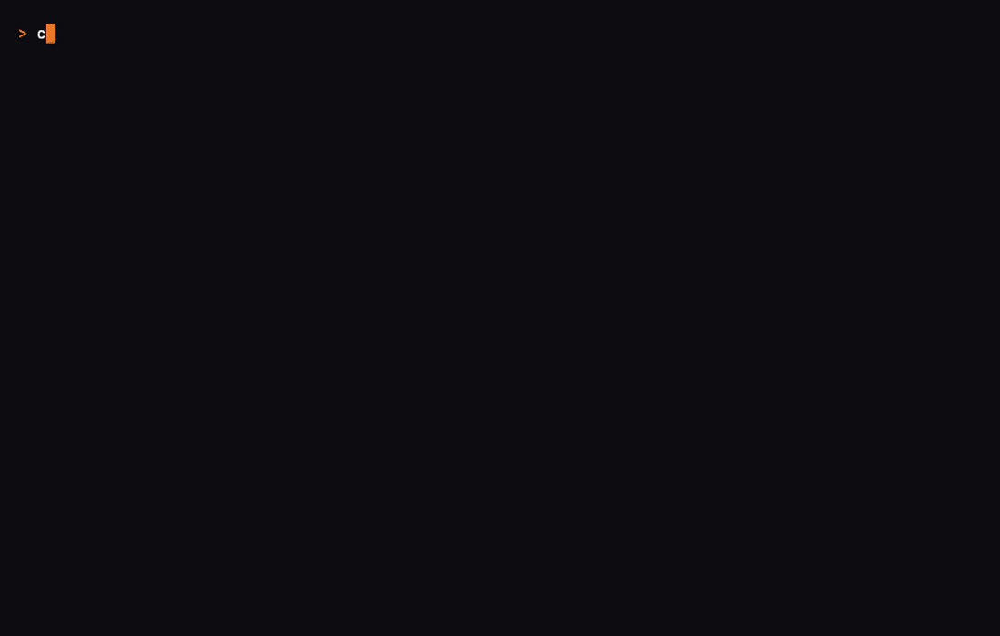
</p>

`camp project list` browses the projects in the current camp, grouped by type.

<p align="center">
  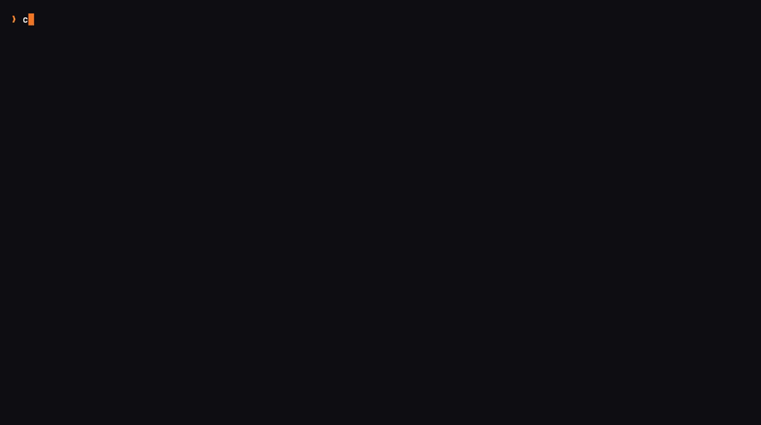
</p>

</details>

<details open>
<summary>Find work, capture an idea, and sort the inbox</summary>

**Find work across the camp.** `camp workitem` brings intents, research, designs, and festivals into one searchable list.

<p align="center">
  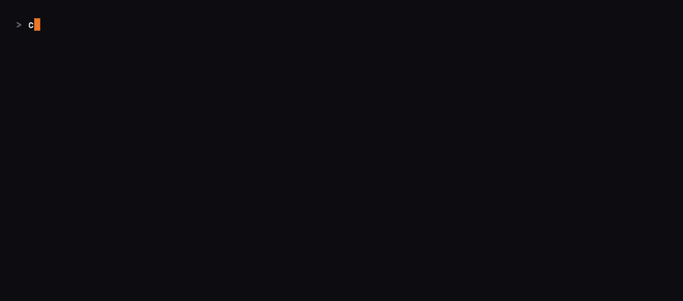
</p>

**Capture an idea.** `camp intent add` saves it to the inbox for later.

<p align="center">
  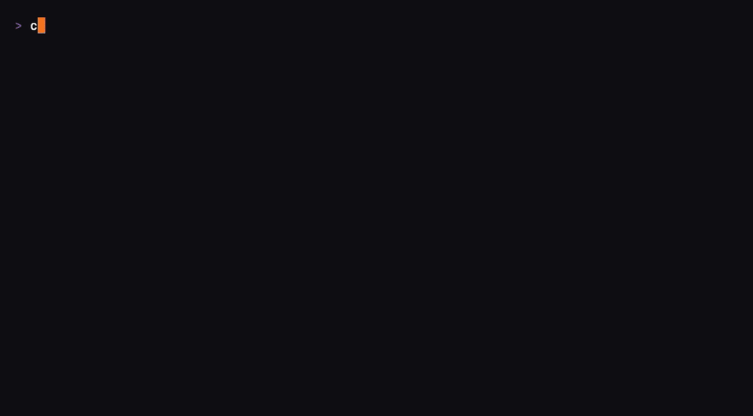
</p>

**Sort the inbox.** `camp intent explore` lets you browse intents by status and read their details.

<p align="center">
  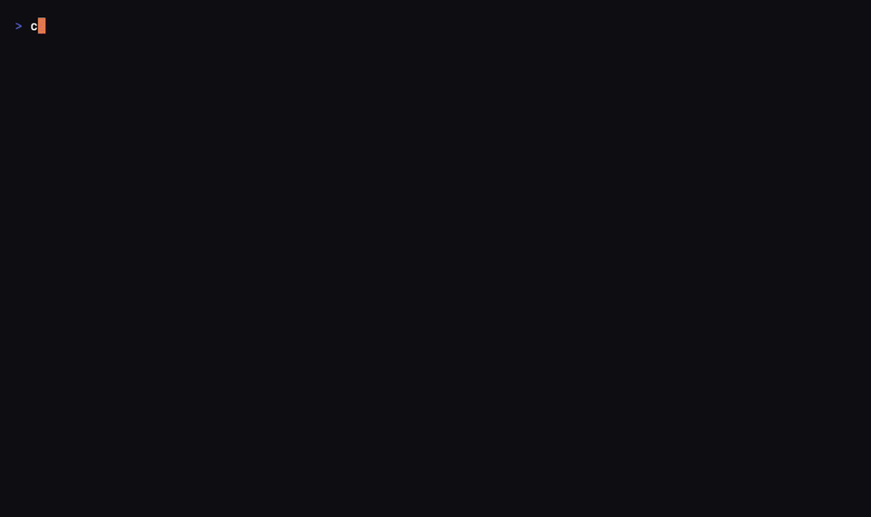
</p>

</details>

<details open>
<summary>See which festivals are active and inspect a plan</summary>

`fest list` groups festivals by status, so you can see what's active, ready, or still being planned.

<p align="center">
  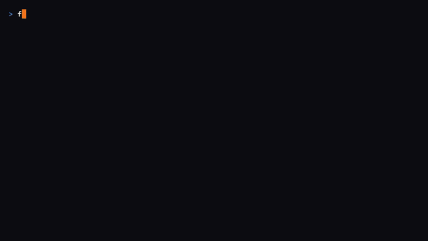
</p>

`fest show` opens the structure of a plan, from its phases down to individual tasks.

<p align="center">
  
</p>

</details>

<details open>
<summary>Start fresh after a merged change</summary>

`camp fresh configure` sets the follow-up commands that run after a project syncs.

<p align="center">
  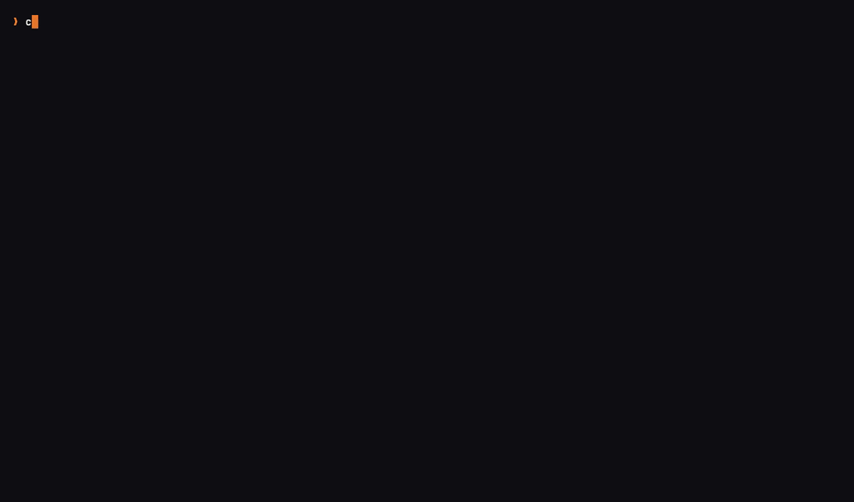
</p>

`camp fresh` checks out the default branch, pulls, prunes merged branches, and runs those follow-ups.

<p align="center">
  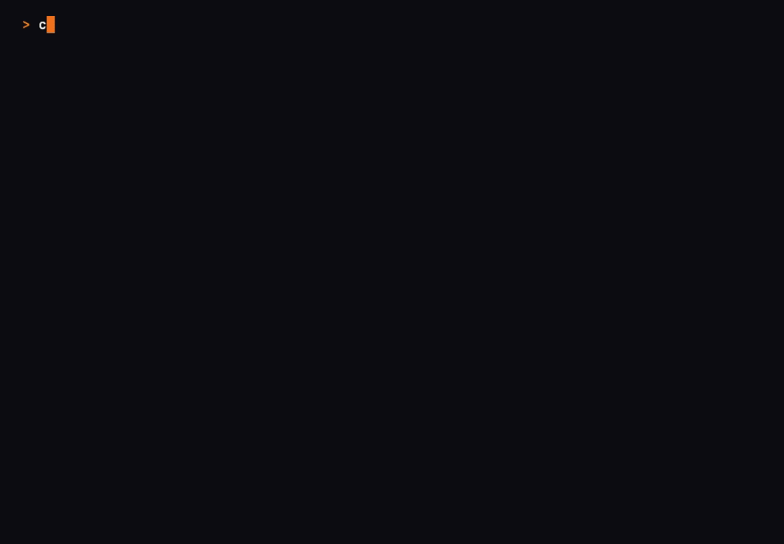
</p>

</details>

<details open>
<summary>Add testing and review gates to a plan</summary>

`fest gates apply` previews the quality gates it will add before applying them with approval.

<p align="center">
  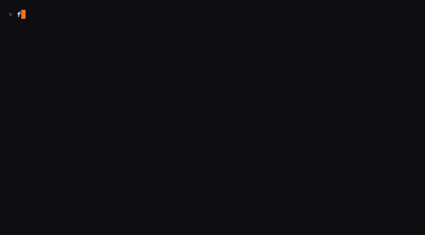
</p>

</details>

<details open>
<summary>Review old work and clear space for what's next</summary>

`camp dungeon crawl` walks through stale work so you can choose what to keep or archive.

<p align="center">
  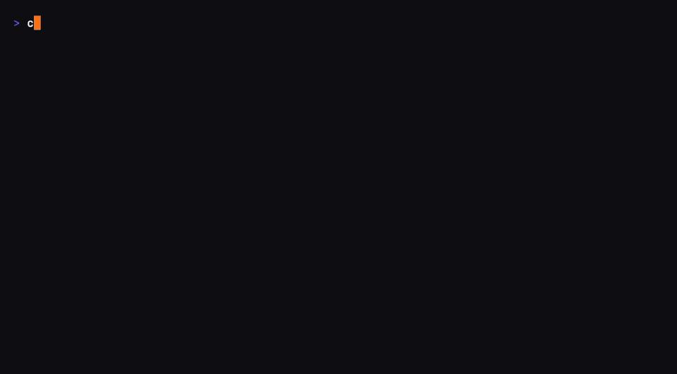
</p>

</details>

<details open>
<summary>Reach a camp on another machine</summary>

`camp machine` lists computers camp can hop to, and can add one from your Tailscale network.

<p align="center">
  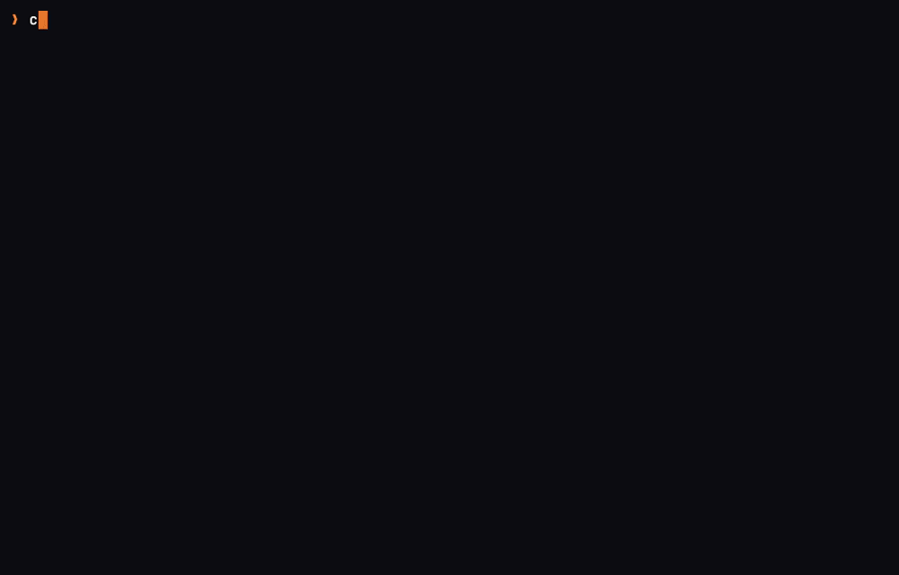
</p>

</details>

<details open>
<summary>Open the Festival installer</summary>

`festival` opens the suite manager: install the tools, check the setup, and launch camp and fest.

<p align="center">
  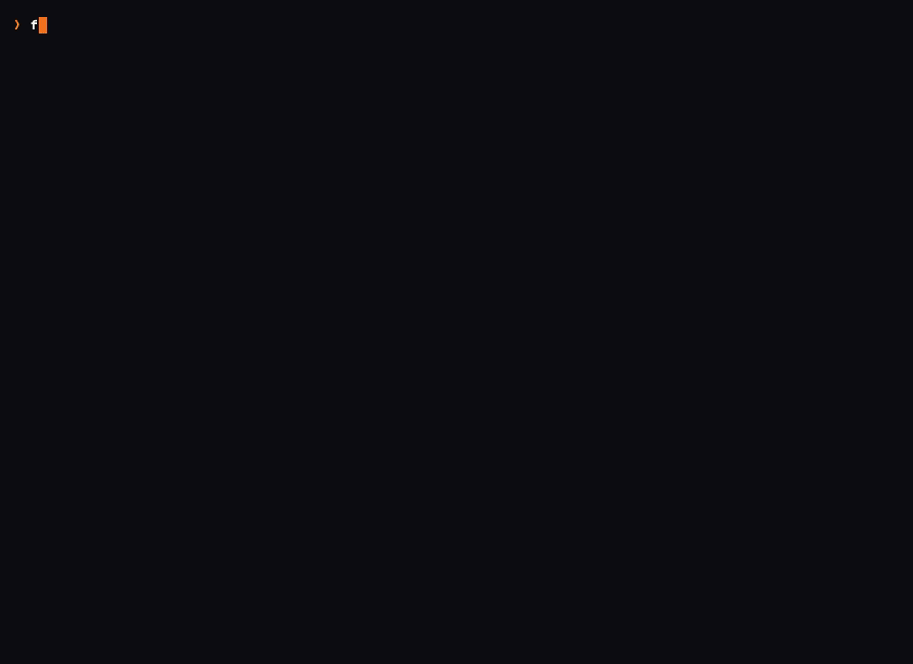
</p>

</details>

<details>
<summary>Watch a longer Festival session <strong>(click to expand video preview)</strong></summary>

An earlier Festival workflow recording at 16× playback speed. Use the setup instructions above for the current first-run path.

<p align="center">
  <a href="https://youtu.be/FY6vm74oa8o">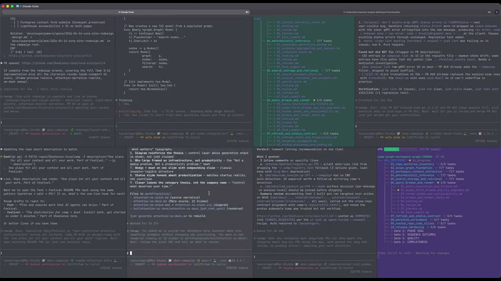</a>
</p>

</details>

[More video walkthroughs and demos](https://docs.fest.build/videos/)

## Fits the tools you already use

**Can I keep my issue tracker?**

Yes. Keep issues where your team coordinates, and use Festival for the agent's plan and work record. Intents and other work items live in files, so scripts or justfiles can connect them to an external service's API. Ask your agent to help build the connection you need. [See the workflow](https://docs.fest.build/compare/festival-vs-issue-trackers/).

**Can I change agents partway through?**

Yes. The next agent can read the same saved plan, decisions, and progress. Give it the festival location and access to the linked project. [Agent handoff guide](https://docs.fest.build/use-cases/ai-agent-handoff/).

**Do I need a Festival account?**

The CLI tools are free to use and run locally without a Festival account. Your agent's account, model costs, and permissions remain with the provider you choose.

## Keep going

- [Join the Obedience Corp Discord](https://discord.gg/Rt7dDY6VqD): get help with Festival, compare workflows, and share what you build.
- [Documentation](https://docs.fest.build/): guides, use cases, and CLI reference.
- [First festival tutorial](https://docs.fest.build/tutorials/first-festival/): a hands-on walkthrough of the plan structure.
- [Examples](examples/) and [templates](templates/): work you can inspect and adapt.
- [Plugin authoring](https://docs.fest.build/guides/plugin-authoring/): extend `camp` and `fest` with your own commands.
- [Report a bug or request a feature](https://github.com/Obedience-Corp/festival/issues): tell us what happened or what would help.
- [Give feedback](https://fest.build/feedback/) or [read the blog](https://fest.build/blog/).

**Festival App is in development.** The CLI tools are available now. [See what's coming](https://fest.build/#app).

If Festival is useful to you, **star this repository** to help other developers discover it. A bug report, a workflow you share, or an example of work you've handed off helps us improve it.

[Apache License 2.0](LICENSE) · Built by [Obedience Corp](https://obediencecorp.com/).
